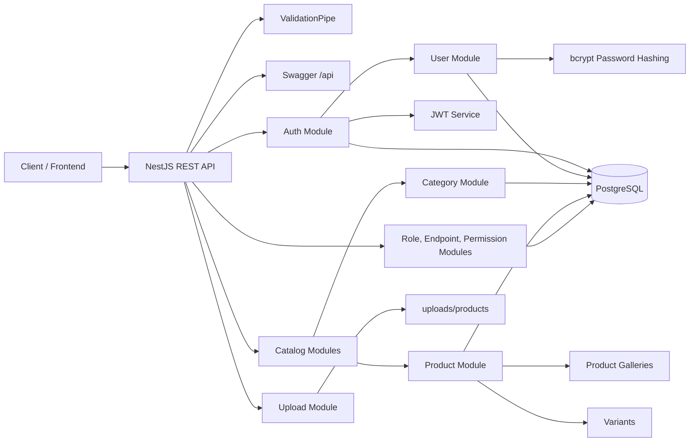
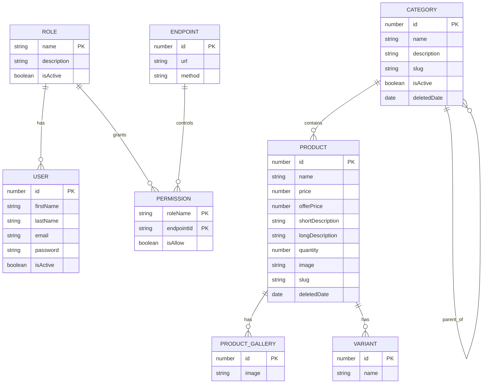

# Nest E-Commerce API

A modular e-commerce backend built with NestJS, TypeScript, TypeORM, PostgreSQL, JWT authentication, file uploads, and Swagger documentation. The project is structured around real API domains such as authentication, users, roles, permissions, categories, products, product galleries, variants, and upload handling.

This README is written for portfolio and resume review: it highlights the architecture, important engineering decisions, and the fastest way to run the project locally.

## Highlights

- REST API built with NestJS 11 and TypeScript.
- PostgreSQL persistence with TypeORM entities and repositories.
- JWT-based sign up, sign in, and protected current-user endpoint.
- Password hashing with bcrypt before user persistence.
- Category and product catalog APIs with slug generation.
- Product image upload support using Multer disk storage.
- Global request validation through Nest validation pipes.
- DTO response transformation with `class-transformer`.
- Swagger documentation available at `/api`.
- Endpoint discovery at application bootstrap for permission mapping.
- Role, endpoint, and permission entities designed for access-control workflows.

## Tech Stack

| Area | Technology |
| --- | --- |
| Runtime | Node.js |
| Framework | NestJS |
| Language | TypeScript |
| Database | PostgreSQL |
| ORM | TypeORM |
| Authentication | JWT, bcrypt |
| Validation | class-validator, class-transformer |
| File Uploads | Multer |
| API Docs | Swagger / OpenAPI |
| Testing | Jest, Supertest |

## Architecture

The application follows a module-first NestJS architecture. Each feature owns its controller, service, DTOs, and entity where applicable.



More diagrams are available in [docs/architecture.md](docs/architecture.md), including request flow, module map, and ER diagram.

## Project Structure

```text
src/
  app.module.ts                 # Root module and database configuration
  main.ts                       # Bootstrap, validation pipe, Swagger, endpoint discovery
  auth/                         # Sign up, sign in, JWT issuing
  user/                         # User persistence and current-user workflow
  role/                         # Role management
  permissions/                  # Role-to-endpoint permission mapping
  endpoint/                     # Discovered API endpoint records
  category/                     # Category CRUD and category slugs
  product/                      # Product CRUD, soft delete, product slugs
  product-galleries/            # Product gallery records
  variants/                     # Product variant records
  upload/                       # Product image upload handling
  cores/
    guards/                     # JWT auth guard
    decorators/                 # Current user decorator
    interceptors/               # DTO response transformer
utils/
  app.util.ts                   # Route discovery helper
docs/
  architecture.md               # Portfolio architecture diagrams
```

## Core Features

### Authentication

- `POST /api/v1/auth/sign-up` creates a user, hashes the password, assigns the default `user` role, and returns an access token.
- `POST /api/v1/auth/sign-in` validates credentials with bcrypt and returns a JWT access token.
- `GET /api/v1/users/me` uses the JWT guard and current-user decorator to return the authenticated user payload.

### Catalog

- Categories support creation, listing, lookup, update, and soft deactivation.
- Products support create, list, lookup by id, lookup by slug, update, and soft delete.
- Product slugs are generated automatically from the product name and timestamp.
- Products are related to categories, galleries, and variants.

### Access Control Foundation

- Roles represent user groups such as `user` or `admin`.
- Endpoints are discovered from the Nest router during bootstrap and stored in the database.
- Permissions connect roles to endpoints with an `isAllow` flag.

### Uploads

- `POST /api/v1/upload` accepts a `productImage` file.
- Files are stored under `uploads/products`.
- Upload validation includes a maximum file size rule.

## Database Model



## Getting Started

### Prerequisites

- Node.js 20 or newer recommended.
- npm.
- PostgreSQL running locally.
- A PostgreSQL database named `ecommerce_nest` or matching configuration in `src/app.module.ts`.

### Installation

```bash
npm install
```

### Environment

Create a `.env` file from the example:

```bash
cp .env.example .env
```

Required runtime variables:

```env
PORT=3000
JWT_SECRET_KEY=change-me
JWT_EXPIRATION_TIME=7d
```

The current database connection is configured in `src/app.module.ts` for a local PostgreSQL instance. For production or team use, move the database host, port, username, password, and database name into environment variables before deployment.

### Run the API

```bash
npm run start:dev
```

The API starts on:

- Base URL: `http://localhost:3000`
- Swagger docs: `http://localhost:3000/api`

## Useful Scripts

```bash
npm run start:dev   # Start development server with watch mode
npm run build       # Compile TypeScript
npm run start:prod  # Run compiled production build
npm run lint        # Run ESLint with auto-fix
npm run test        # Run unit tests
npm run test:e2e    # Run e2e tests
npm run test:cov    # Generate test coverage
```

## API Overview

| Module | Main Routes |
| --- | --- |
| Auth | `POST /api/v1/auth/sign-up`, `POST /api/v1/auth/sign-in` |
| Users | `POST /api/v1/users`, `GET /api/v1/users/me`, `GET /api/v1/users` |
| Roles | `POST /api/v1/roles`, `GET /api/v1/roles`, `GET /api/v1/roles/:name` |
| Categories | `POST /api/v1/categories`, `GET /api/v1/categories`, `GET /api/v1/categories/:id` |
| Products | `POST /api/v1/products`, `GET /api/v1/products`, `GET /api/v1/products/:id`, `GET /api/v1/products/slug/:slug` |
| Variants | `POST /api/v1/variants`, `GET /api/v1/variants/:id`, `GET /api/v1/variants/:productId/product` |
| Endpoints | `GET /api/v1/endpoints/all`, `POST /api/v1/endpoints` |
| Permissions | `POST /permissions`, `GET /permissions`, `PATCH /permissions/:id` |
| Uploads | `POST /api/v1/upload` |

## Resume-Friendly Summary

Built a modular NestJS e-commerce REST API with PostgreSQL persistence, JWT authentication, role/permission data modeling, Swagger documentation, DTO validation, response serialization, file uploads, and route discovery for endpoint permission mapping.

## Resume Bullet Ideas

- Designed and implemented a modular NestJS e-commerce backend with TypeORM entities for users, roles, permissions, categories, products, galleries, and variants.
- Built JWT authentication with bcrypt password hashing and protected user-context routes.
- Added Swagger API documentation, global validation, DTO-based response shaping, and product image upload support.
- Modeled endpoint-level permissions by discovering application routes at startup and persisting route metadata for access-control workflows.

## Notes for Deployment

- Disable `synchronize: true` and use migrations before deploying to production.
- Move database credentials out of source code and into environment variables.
- Replace local disk upload storage with cloud object storage for production deployments.
- Add stricter role-based guards before exposing admin workflows.
