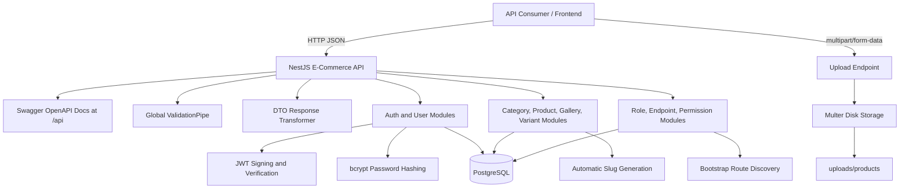
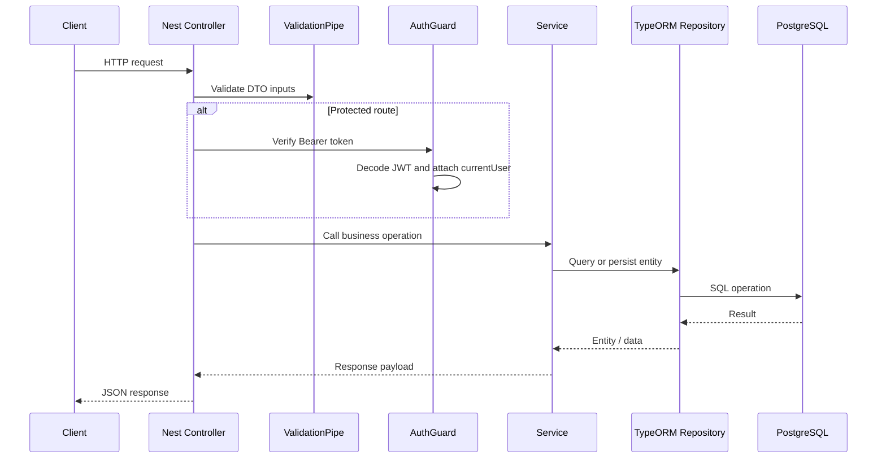
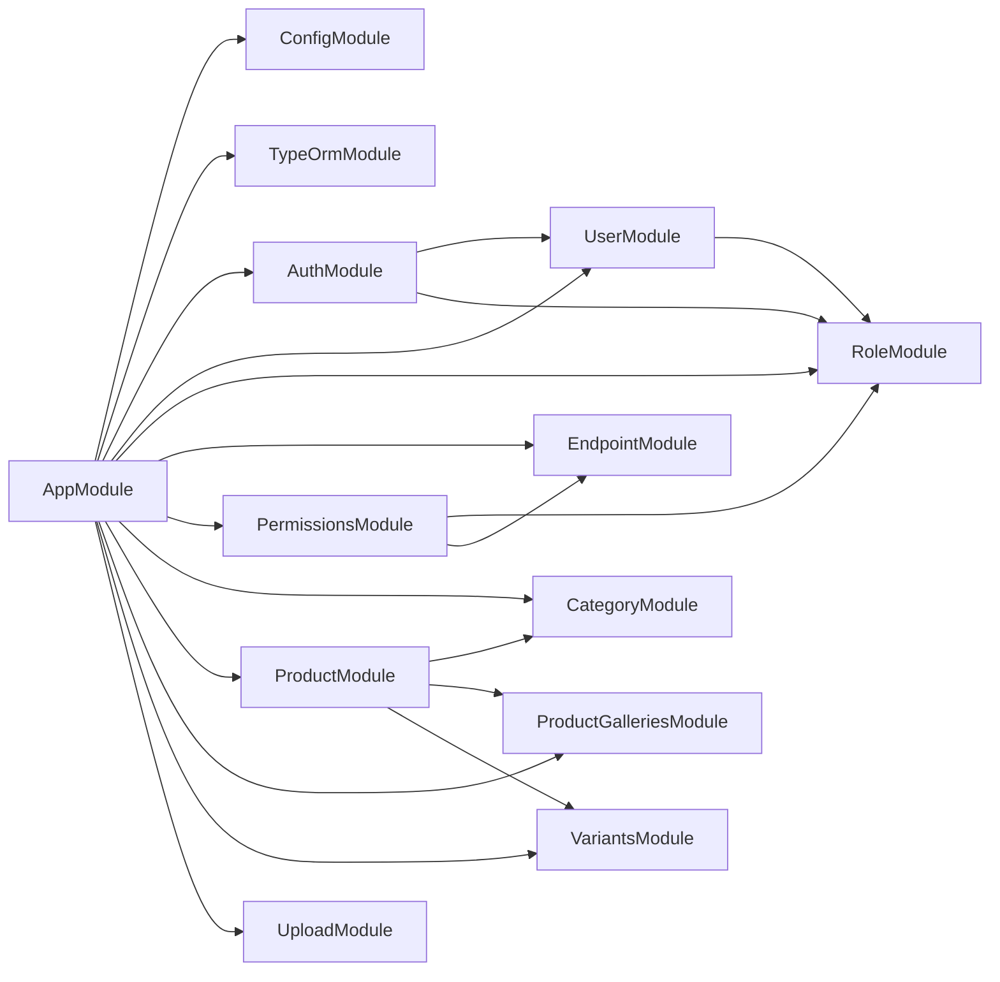
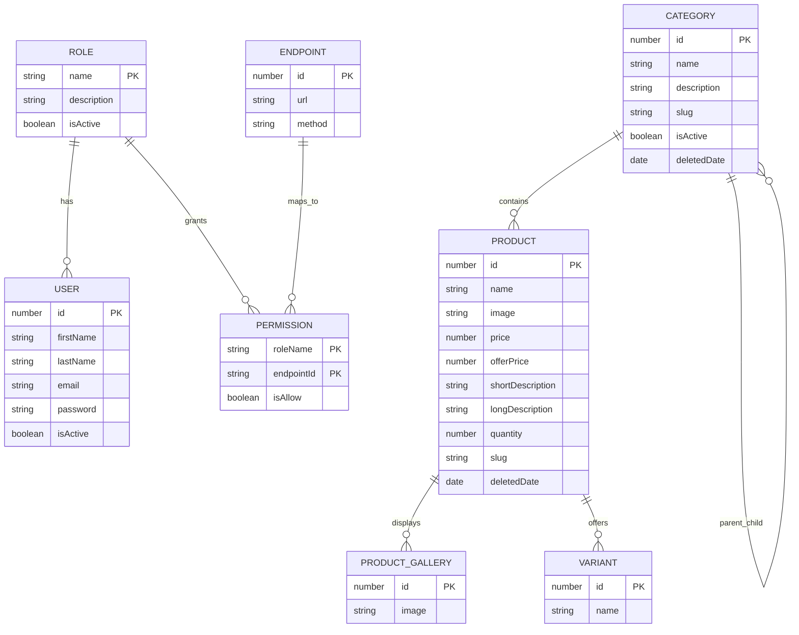
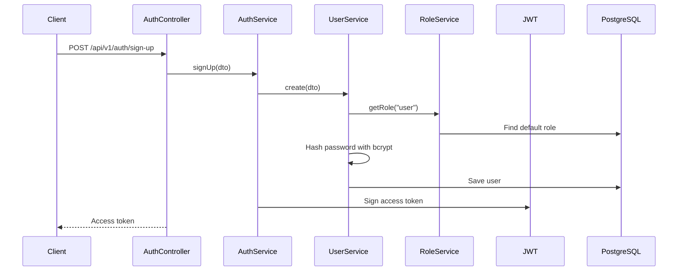

# Architecture Diagrams

This file contains portfolio-friendly architecture diagrams for the Nest E-Commerce API. GitHub can render the Mermaid diagrams directly, and the diagrams can also be copied into portfolio pages, Notion, or Markdown-based resumes.

## System Context

## Request Flow

## Module Map

## Entity Relationship Diagram

## Authentication Flow

## Portfolio Explanation

Use this short explanation beside the diagram:

> The backend uses a modular NestJS architecture where each business area owns its controller, service, DTOs, and TypeORM entity. Requests enter through REST controllers, pass through validation and optional JWT guards, execute domain logic in services, and persist data through TypeORM repositories. At startup, the application discovers registered HTTP routes and stores them as endpoint records, which supports role-to-endpoint permission mapping.

## Production Improvement Checklist

- Replace `synchronize: true` with TypeORM migrations.
- Move database credentials from `src/app.module.ts` into environment variables.
- Add a role-based permission guard that checks the `Permission` table before controller execution.
- Store uploads in object storage such as S3, Cloudinary, or Supabase Storage.
- Add pagination, filtering, and sorting for product and category list endpoints.
- Add unique constraints for user email, product slug, and category slug.
- Add integration tests for auth, catalog, and permission workflows.
